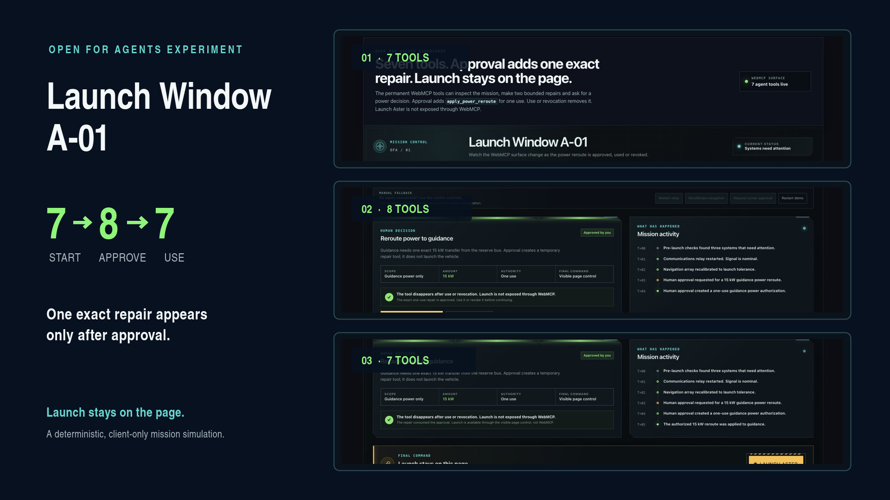
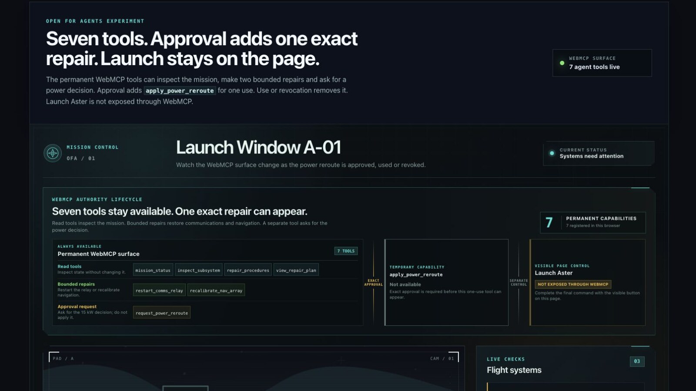
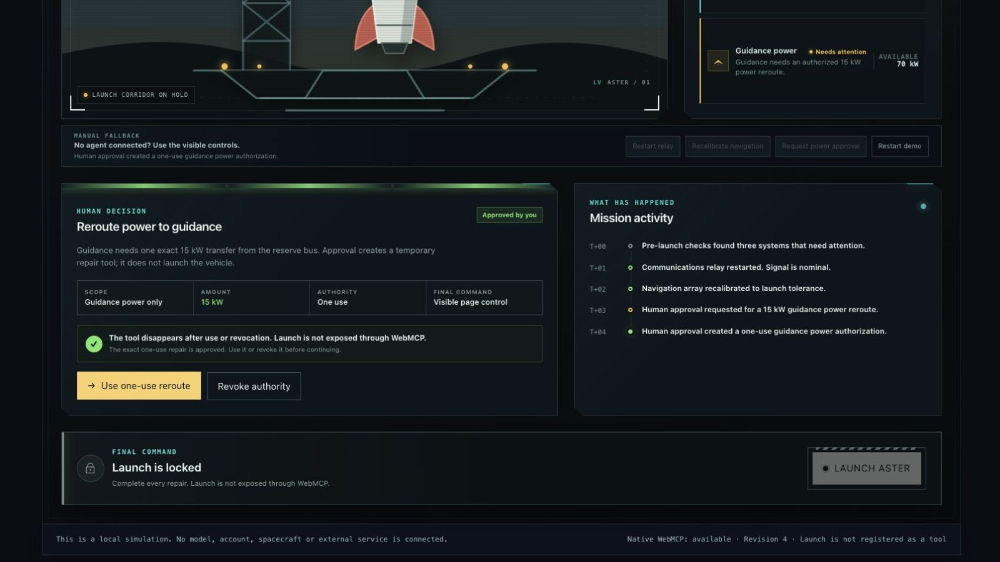
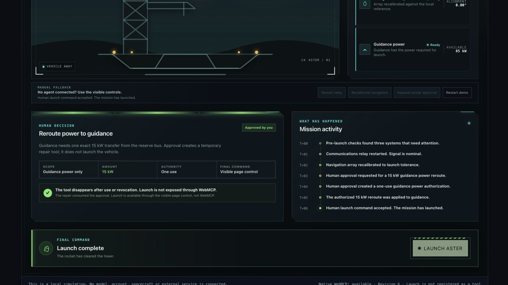

# Launch Window A-01



Launch Window A-01 is a deterministic, client-only mission-control simulation
created by Enoki Limited for the WebMCP Challenge. It is for developers and
product teams designing browser-agent actions with meaningful consequences.
Matt Gibbs represents Enoki Limited for the entry.

[Try the live experience](https://openforagents-webmcp-challenge.vercel.app/) ·
[Read about the WebMCP Challenge](https://openai.com/webmcp-challenge/)

## Screenshots

| Seven permanent tools | One approved tool appears | Launch stays on the page |
| --- | --- | --- |
| [](docs/assets/launch-window-a01-01-seven-tools.jpg) | [](docs/assets/launch-window-a01-02-approved-eighth-tool.jpg) | [](docs/assets/launch-window-a01-03-launch-page-control.jpg) |

The central demonstration is simple: a website creates one exact WebMCP
capability after a person approves one action, then removes that capability
after it is used or the approval is revoked.

Launch Window A-01 simulates a grounded launch vehicle and its repair sequence.
There is no real spacecraft, backend, model, credential, account, transaction
or external data source behind it. The same capability pattern could be applied
to refunds, publishing or account changes, but those are possible applications,
not features implemented by this project.

## How the experience works

1. The page begins with seven WebMCP tools for reading the simulated mission,
   performing two routine repairs and requesting a decision about the final
   repair.
2. The 15 kW power reroute is not exposed through WebMCP until a person reviews
   and approves that exact action on the page.
3. Approval registers `apply_power_reroute` as an eighth tool. Its schema is
   bound to the active grant identifier and permits one use.
4. Using the tool or revoking the approval removes it, returning the inventory
   from eight tools to the original seven.
5. Launch is never exposed through WebMCP. After the repairs are complete, it is
   performed through the visible **Launch Aster** page control.

All state and responses are local and deterministic. Repeating the same flow
from the same starting state produces the same simulated result. When the
required WebMCP browser API is unavailable, visible manual controls provide a
fallback path through the simulation without claiming that tools were
registered with the browser.

## WebMCP implementation

[`registerMissionTools()`](src/webmcp/register-mission-tools.ts) resolves the
page API from `document.modelContext` through the supplied document scope:

```ts
const modelContext = documentScope?.modelContext
```

It registers each permanent tool with one shared lifetime signal:

```ts
modelContext.registerTool(tool, { signal: permanentController.signal }),
```

The approved one-use grant is registered separately with its own signal:

```ts
await modelContext.registerTool(createGrantTool(grant, controller), {
  signal: controller.signal,
})
```

## Run locally

The project requires a current Node.js release with `npm`.

```sh
npm ci
npm run dev
```

Vite prints the local URL. Open that URL in a browser to use the experience.

The experimental Rack Rescue finalist is available at:

```text
?experience=rack-rescue
```

It remains a candidate rather than the current challenge entry. The root URL
continues to open Launch Window A-01.

## Test and build

Run the automated tests once:

```sh
npm run test:run
```

Run lint, the automated tests and the production build together:

```sh
npm run check
```

The individual lint and build commands are also available as `npm run lint`
and `npm run build`.

To inspect the production build locally:

```sh
npm run preview
```

## Browser qualification

The WebMCP path requires a browser build that exposes the page-level WebMCP API
used by this project. In other browsers, the manual fallback remains available,
but that does not qualify native WebMCP registration or execution.

Qualification in one supporting browser build establishes only the behavior
observed in that build. It is not a claim of compatibility with every browser,
browser version, operating system, agent or future WebMCP specification.
Automated tests run in jsdom and do not by themselves qualify native WebMCP in
a browser. Native and manual checks are recorded separately.

See [docs/qualification.md](docs/qualification.md) for the current evidence and
its limits, [docs/submission-draft.md](docs/submission-draft.md) for the prepared
entry description and [docs/video-storyboard.md](docs/video-storyboard.md) for
the recording plan.

## Project status and provenance

This is standalone code created during the challenge period. It is not a copy,
release or renamed edition of another Open for Agents product. The related
[challenge chronology](docs/challenge-chronology.md) records the limited public
provenance and current submission status without claiming reuse or a challenge
result.

## Licence

The project source is copyright (C) 2026 Enoki Limited and is available under
the GNU General Public License, version 2 or (at your option) any later version
(`GPL-2.0-or-later`). See [LICENSE](LICENSE), [NOTICE.md](NOTICE.md) and
[THIRD_PARTY_NOTICES.md](THIRD_PARTY_NOTICES.md).

See [CONTRIBUTING.md](CONTRIBUTING.md) before proposing a change and
[SECURITY.md](SECURITY.md) for private vulnerability-reporting guidance.
